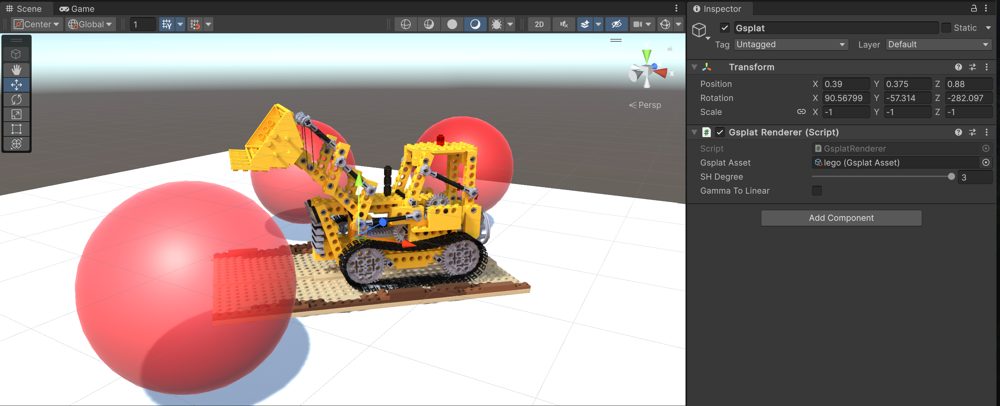

# Gsplat

A Unity package for rendering [3D Gaussian Splatting](https://repo-sam.inria.fr/fungraph/3d-gaussian-splatting/) (3DGS). Supports Unity 2022 and later. 

The 3DGS rendering pipeline design of this package is inspired by [PlayCanvas](https://github.com/playcanvas/engine), which treats 3DGS objects similarly to transparent meshes that use a custom shader. With this approach, only an additional sorting pass needs to be inserted into each camera's command buffer. This design makes it easier to integrate 3DGS rendering into an existing pipeline, allows the draw calls for 3DGS objects to be correctly inserted into the existing rendering queue for transparent meshes (based on their bounding boxes), rather than rendering all 3DGS objects to a separate render texture as is done in [aras-p/UnityGaussianSplatting](https://github.com/aras-p/UnityGaussianSplatting). 

That sounds great, but at what cost?

Most 3DGS assets are trained in Gamma space, following the official implementation. This means that the alpha blending for the Gaussians is also performed in Gamma space.  Since there is no longer an additional render texture that would allow us to convert the color space after the alpha blending of 3DGS, you must ensure your project's color space (`Edit > Project Settings > Player > Other Settings > Rendering > Color Space`) is set to "Gamma" for the 3DGS assets to be rendered correctly (be aware that HDRP doesn't support Gamma mode). For projects using a linear color space, you must retrain the 3DGS asset with linear-space images. While this plugin offers a `Gamma To Linear` option as a workaround, converting the color space before alpha blending leads to incorrect results and will lower the 3DGS rendering quality.

## Highlights

- Supports Built-in Render Pipeline (BiRP), URP (Requires Unity 6+) and HDRP

- Gaussians can be correctly blended with transparent meshes based on their bounding boxes

- Supports reading & rendering PLY files with SH degrees 0-3

- Supports orthographic projection

- Compatible with MSAA

- Compatible with XR

  - | XR Render Mode        | BiRP | URP  | HDRP |
    | --------------------- | ---- | ---- | ---- |
    | Multi-pass            | ✓    | ✓    | ✗    |
    | Single Pass Instanced | ✗    | ✓    | ✗    |

## Platform Compatibility

The sorting pass, built upon [b0nes164/GPUSorting](https://github.com/b0nes164/GPUSorting), requires wave / subgroups operations which are only available in D3D12, Metal or Vulkan graphics APIs. WebGPU supports the subgroup operations but Unity has not implemented it. Anything using other graphics APIs will not work. I have only tested on Windows, but the compatibility of this package should be similar to [aras-p/UnityGaussianSplatting](https://github.com/aras-p/UnityGaussianSplatting).

## Usage

### Install

After cloning or downloading this repository, open your Unity project (or create a new one). Navigate to `Window > Package Manager`, click the `+` button, select `Install package from disk...`, and then choose the `package.json` file from this repository.

### Setup

First, ensure your project is using a supported Graphics API. For Windows: in `Edit > Project Settings > Player > Other Settings`, uncheck `Auto Graphics API for Windows`. Then, in the `Graphics APIs for Windows` list, add `Vulkan` or `Direct3D12` and remove any other options. Unity will require a restart to switch the Graphics API. You may need to perform similar steps for other platforms.

The next steps depend on the Render Pipeline you are using:

- BiRP: Does not need any extra setup.
- URP: Add `Gsplat URP Feature` to the URP renderer settings.
  - Find the `Universal Renderer Data` your project is using, click the `Add Renderer Feature` button, and choose `Gsplat URP Feature.`
  - Requires Unity 6 or later, and Render Graph "Compatibility Mode" in URP settings must be turned off!
- HDRP: Add `Custom Pass` volume object in your scene and a `Gsplat HDRP Pass` entry to it. The injection Point should be set to `Before Transparent`.

### Import Assets

Copy or drag & drop the PLY file anywhere into your project's `Assets` folder. The package will then automatically read the file and import it as a `Gsplat Asset`.

### Add Gsplat Renderer

Create or choose a game object in your scene, and add the `Gsplat Renderer` component on it. Point the `Gsplat Asset` field to one of your imported Gsplat Assets. Then it should appear in the viewport.

The `SH Degree` option sets the order of SH coefficients used for rendering. The final value is capped by the Gsplat Asset's `SH Bands`.

The `Gamma To Linear` option is offered as a workaround to render Gamma Space Gsplat Assets in a project using the Linear Space. This will degrade the rendering quality, so changing the color space of the project or retraining the 3DGS asset is the recommended approach. If your project uses a linear color space and you do not wish to retrain your 3DGS assets, it is recommended to use [aras-p/UnityGaussianSplatting](https://github.com/aras-p/UnityGaussianSplatting).

## Additional Documentation

- [Implementation Details](/Documentation~/Implementation%20Details.md)

## Project Using Gsplat

- [HiFi-Human/DynGsplat-unity](https://github.com/HiFi-Human/DynGsplat-unity) - A Unity package for rendering and playing dynamic gaussian splatting sequences

## License

This project is released under the MIT license. It is built upon several other open-source projects:

-   [playcanvas/engine](https://github.com/playcanvas/engine), MIT License (c) 2011-2024 PlayCanvas Ltd
-   [aras-p/UnityGaussianSplatting](https://github.com/aras-p/UnityGaussianSplatting), MIT License (c) 2023 Aras Pranckevičius
-   [b0nes164/GPUSorting](https://github.com/b0nes164/GPUSorting), MIT License (c) 2024 Thomas Smith

